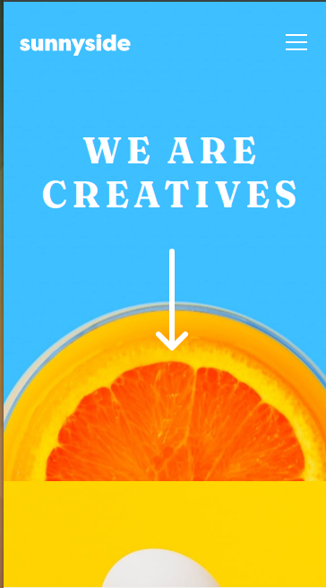

# Frontend Mentor - Sunnyside agency landing page solution

This is a solution to the [Sunnyside agency landing page challenge on Frontend Mentor](https://www.frontendmentor.io/challenges/sunnyside-agency-landing-page-7yVs3B6ef). Frontend Mentor challenges help you improve your coding skills by building realistic projects.

## Table of contents

- [Overview](#overview)
  - [The challenge](#the-challenge)
  - [Screenshot](#screenshot)
  - [Links](#links)
- [My process](#my-process)
  - [Built with](#built-with)
  - [What I learned](#what-i-learned)
  - [Continued development](#continued-development)
- [Author](#author)

## Overview

### The challenge

Users should be able to:

- View the optimal layout for the site depending on their device's screen size
- See hover states for all interactive elements on the page

### Screenshot

### Links

- Solution URL: [Link](https://your-solution-url.com)
- Live Site URL: [Link](https://angelpineda-dev.github.io/frontendMentor-sunnysideLandingPage/)

## My process

### Built with

- Semantic HTML5 markup
- CSS custom properties
- Flexbox
- CSS Grid
- Mobile-first workflow

### What I learned

I learned to develope a complate landing page to fit each part in the place it should be.

### Continued development

For pages of this sizes or bigger, I think I'll need use tools like SASS or Bootstrap to keep the styles in order.

## Author

+ Website - [www.angelpineda.dev](https://angelpineda-dev.github.io/Home/)
+ Frontend Mentor - [@angelp495](https://www.frontendmentor.io/profile/angelp495)
+ Twitter - [@angelpineda_dev](https://twitter.com/angelpineda_dev)
